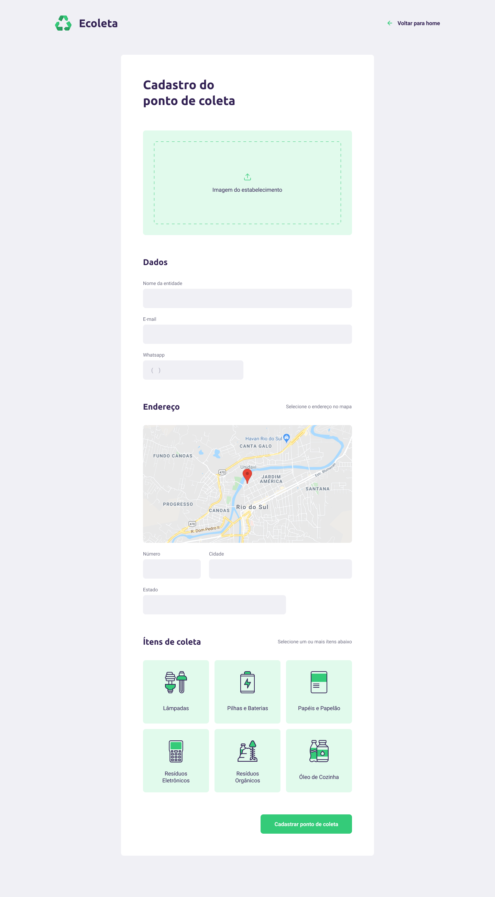
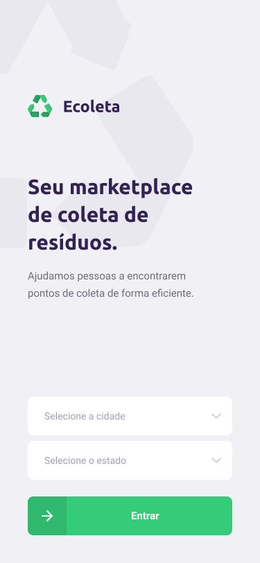
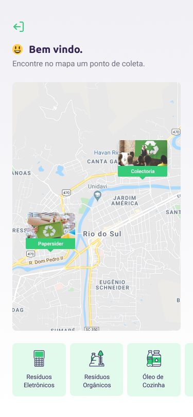
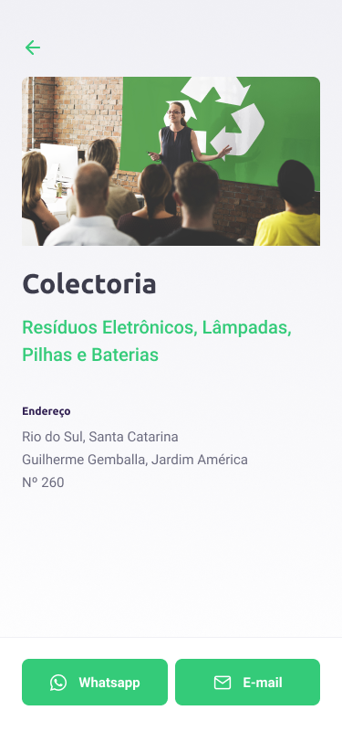

<h1>
  
</h1>

O Ecoleta é um projeto criado para ajudar as pessoas a encontrar pontos de coleta para reciclagem.

Esse projeto foi feito durante a **Next Level Week #01** ministrada pela [Rocketseat](https://rocketseat.com.br/).
Desse modo, foi desenvolvido um back end em **Node**, uam aplicaoção web em **ReactJS** e um app em **React Native**.

# Como utilizar

Para utilizar a aplicação é preciso ter o Node instalado na sua maquina.

```sh
  # Instale as dependências
  $ npm install

  ## Crie o banco de dados
  $ cd server
  $ npm run knex:migrate
  $ npm run knex:seed

  # Inicie o back end
  $ npm run dev

  # Inicie o front end
  $ cd web
  $ npm start

  # Inicie a aplicação mobile
  $ cd mobile
  $ npm start
```


# Telas

O layout da aplicação foi desenvolvido pela **Rocketseat** e está disponível no [Figma](https://www.figma.com/file/1SxgOMojOB2zYT0Mdk28lB/Ecoleta?node-id=0%3A1): 

<table cellspacing="0" cellpadding="0">
  <tr>
    <td colspan="3"></td>
    <td rowspan="2"></td>
  </tr>
  <tr>
    <td></td>
    <td></td>
    <td></td>
  </tr>
</table>

# Tecnologias

Algumas das tecnologias utilizadas são:

- [Node](https://nodejs.org/en/)
- [ReactJS](https://reactjs.org/)
- [React Native](https://reactnative.dev/)
- [SQLite3](https://sqlite.org/index.html)
- [Knex](http://knexjs.org/)
- [Expo](https://expo.io/)
- [Express](https://github.com/expressjs/express)
- [CORS](https://github.com/expressjs/cors)
- [Axios](https://github.com/axios/axios)
- [Leaflet](https://leafletjs.com/)
- [React Leaflet](https://react-leaflet.js.org/)
- [React Router](https://reacttraining.com/react-router/)
- [React Dropzone](https://react-dropzone.js.org/)
- [Multer](https://github.com/expressjs/multer)
- [celebrate](https://github.com/arb/celebrate)


# Licença

Esse projeto está sob a licença MIT. Consulte [LICENSE](LICENSE) para mais informações.
